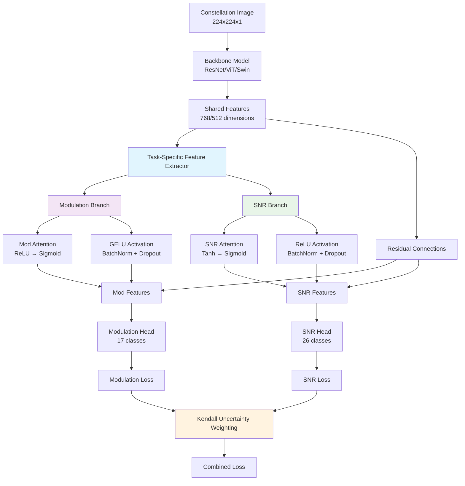

# CLAUDE.md

This file provides guidance to Claude Code (claude.ai/code) when working with code in this repository.

## Project Overview

This is a modulation explainability research project that combines **enhanced multi-task learning** with perturbation-based explainability for Automatic Modulation Classification (AMC). The framework addresses both performance and interpretability challenges by transforming I/Q signal data into constellation diagrams and employing a ResNet-based architecture to simultaneously classify modulation schemes and predict discrete SNR values.

### Research Paper Context
This work was submitted as "Constellation Diagram Augmentation and Perturbation-Based Explainability for Automatic Modulation Classification" and introduces novel perturbation-based explainability techniques using the Perturbation Impact Score (PIS) metric to analyze critical regions in constellation diagrams that drive model decisions.

## Technology Stack

- **Language**: Python 3.11
- **Deep Learning**: PyTorch 2.4.1, TorchVision 0.19.1
- **Data Processing**: NumPy (<2.0), Pandas, H5PY, SciPy
- **Visualization**: Matplotlib, Seaborn
- **Experiment Tracking**: Weights & Biases (wandb)
- **Package Management**: uv (UV package manager)

## Common Development Commands

```bash
# Install dependencies with UV
uv sync

# Train model with default settings (enhanced multi-task learning)
uv run python src/train_constellation.py

# Train with custom parameters and model architecture
uv run python src/train_constellation.py \
    --model_type vit_b_16 \
    --batch_size 32 \
    --snr_list "0,10,20" \
    --mods_to_process "BPSK,QPSK,8PSK" \
    --epochs 100 \
    --base_lr 1e-4 \
    --weight_decay 1e-5 \
    --dropout 0.3 \
    --patience 10

# Train with different architectures
uv run python src/train_constellation.py --model_type resnet18     # Default, fastest
uv run python src/train_constellation.py --model_type resnet34     # Deeper ResNet
uv run python src/train_constellation.py --model_type vit_b_16     # Vision Transformer ViT/16
uv run python src/train_constellation.py --model_type vit_b_32     # Vision Transformer ViT/32 (faster)
uv run python src/train_constellation.py --model_type swin_tiny   # Swin Transformer (fastest, hierarchical)
uv run python src/train_constellation.py --model_type swin_small  # Swin Transformer (balanced)
uv run python src/train_constellation.py --model_type swin_base   # Swin Transformer (largest)

# Resume training from checkpoint (now includes model name)
uv run python src/train_constellation.py --checkpoint checkpoints/best_model_resnet18_epoch_15.pth

# Convert HDF5 data to constellation images
uv run python src/convert_to_constellation.py \
    --h5_dir data/split_hdf5 \
    --snr_list -20,-18,-16,0,10,20,30 \
    --mod_list BPSK,QPSK,8PSK,16PSK

# Test model on perturbed and non-perturbed data
uv run python src/test_constellation.py \
    --model_checkpoint <path_to_checkpoint> \
    --data_dir constellation \
    --perturbation_dir <path_to_perturbation_dir>

# Run hyperparameter sweep with W&B
wandb sweep sweep.yml
wandb agent <sweep_id>

# Generate perturbed constellation data
uv run python src/perturb_constellations.py

# Calculate PID metrics
uv run python src/calculate_pid.py
```

## High-Level Architecture

### Enhanced Multi-Task Learning System
The project implements a **state-of-the-art multi-task learning approach** with:
- **Flexible Backbone Architectures**: ResNet18/34, Vision Transformer (ViT), or Swin Transformer for feature extraction
- **Task-Specific Feature Extraction**: Separate attention and transformation paths prevent task competition
- **Task-Specific Heads**: 
  - Modulation classification (17 digital classes by default)
  - **Discrete SNR prediction** (26 classes: -20 to +30 dB in 2dB intervals)
- **Homoscedastic Uncertainty Weighting**: Well-established Kendall et al. (2018) method that automatically balances task losses using learned uncertainty parameters

### Current Architecture Diagram



### Key Components

1. **Models** (`src/models/`):
   - `ConstellationResNet`: Enhanced ResNet18/34 backbone with **task-specific feature extraction** and dual heads
   - `ConstellationVisionTransformer`: Vision Transformer (ViT-B/16 & ViT-B/32) with **task-specific attention mechanisms**
   - `ConstellationSwinTransformer`: Swin Transformer (Tiny/Small/Base) with hierarchical processing and **task-specific branches**
   - **Task-Specific Feature Extraction**: All models now use separate attention and transformation paths for modulation vs SNR tasks
     - Different activation functions (GELU for mod, ReLU for SNR) create distinct feature distributions
     - Task-specific attention mechanisms prevent feature competition
     - Residual connections with weighted combination (70% task-specific, 30% shared)
   - **Model Selection**: Choose architecture via `--model_type` (resnet18, resnet34, vit_b_16, vit_b_32, swin_tiny, swin_small, swin_base)
   - **Performance Trade-offs**: ResNet fastest (~8-10 it/s), ViT moderate (~2-6 it/s), Swin optimized for sparse data (~5-15 it/s expected)
   - **Default Dataset**: Excludes analog modulations (AM-DSB-SC, AM-DSB-WC, AM-SSB-SC, AM-SSB-WC, FM, GMSK, OOK)

2. **Data Loading** (`src/loaders/`):
   - `ConstellationDataset`: Loads constellation images organized by modulation/SNR
   - `SplitHDF5Dataset`: Direct loader for split HDF5 data format
   - `PerturbationDataset`: Handles perturbed images for robustness testing
   - Images are preprocessed to 224x224 and normalized

3. **Enhanced Loss Functions** (`src/losses/uncertainty_weighted_loss.py`):
   - **`AnalyticalUncertaintyWeightedLoss`**: Homoscedastic uncertainty-based multi-task weighting (Kendall et al. 2018)
     - Well-established method with 1000+ citations and extensive validation
     - Independent task weighting prevents task competition
     - Principled uncertainty modeling with proper regularization
     - Minimum weight constraints (5% per task) for stability
   - **`DistancePenalizedSNRLoss`**: Distance-aware loss for discrete SNR prediction
   - Replaces traditional α/β weighting with learned uncertainty parameters

4. **Data Pipeline**:
   - **Split HDF5**: Pre-organized data by modulation/SNR in `data/split_hdf5/`
   - **Constellation Conversion**: `convert_to_constellation.py` transforms I/Q to images
   - **Training Pipeline**: Direct training from constellation images or HDF5 data
   - **Stratified Splitting**: `utils/data_splits.py` ensures balanced train/val/test distributions

5. **Data Splitting Utilities** (`src/utils/data_splits.py`):
   - **`create_stratified_split()`**: Creates 80/10/10 train/val/test splits with balanced class representation
   - **`verify_stratification()`**: Validates that all (modulation, SNR) combinations are present in each split
   - **Fast Implementation**: Uses cached dataset labels for ~3000x speedup vs individual sample loading
   - **Reproducible**: Fixed random seeds ensure consistent splits across runs

### Data Organization
```
data/
├── RML2016.10a/          # Radio ML datasets
├── RML2018.01A/
└── split_hdf5/           # HDF5 files by modulation type and SNR
constellation/            # Constellation diagram images
perturbed_constellations/ # Perturbed test data
```

### Enhanced Training Strategy
- **Adaptive Multi-Task Learning**: Uncertainty weighting automatically balances modulation and SNR losses
- Adam optimizer with weight decay (1e-5) including uncertainty parameters
- ReduceLROnPlateau scheduler (patience-based)
- **Device-Adaptive Training**: CUDA mixed precision for GPU, optimized MPS/CPU training
- Gradient clipping (max_norm=1.0) for all model and uncertainty parameters
- Early stopping based on validation loss
- **Discrete SNR Training**: 26-class SNR prediction with distance-based penalties
- **Stratified Data Splitting**: 70/15/15 train/val/test split with all classes represented
- **Final Test Evaluation**: Automatic evaluation on held-out test set after training

### Testing and Evaluation
The testing pipeline evaluates models on:
- Original constellation images
- Perturbed images (various blackout percentages)
- Generates confusion matrices and F1 score plots
- Results saved to `confusion_matrices/` and `f1_scores/`
- **Final Test Set Evaluation**: Automatically runs after training completes
- **Stratified Evaluation**: Test set contains balanced representation of all 442 classes

## Research Contributions

### Key Innovations
1. **Multi-Task Learning Framework**: Joint prediction of modulation type (17 digital classes by default) and SNR levels (26 classes), enhancing utility in dynamic wireless environments
2. **Constellation Diagram Augmentation**: Enhanced visual representations using binning, Gaussian smoothing, and normalization techniques
3. **Perturbation-Based Explainability**: Systematic analysis using PIS metric to identify critical constellation regions
4. **Progressive Perturbation Analysis**: Evaluation of classification degradation under varying perturbation levels

### Research Findings
- **High-intensity regions**: Critical for classification (PIS up to 34.8 for 1% brightest pixels)
- **Low-intensity regions**: Minimal impact on performance (PIS as low as 0.95)
- **Multi-task benefits**: Superior SNR prediction and combined accuracy compared to single-task learning
- **Robustness**: Maintains high accuracy across diverse modulation types under challenging noise conditions

## Key Enhancements & Future Work

### ✅ Recent Achievements (2024-2025)
1. **Enhanced Multi-Task Learning**: Kendall et al. (2018) homoscedastic uncertainty weighting with task collapse prevention
2. **Task-Specific Feature Extraction**: Separate attention/transformation paths for modulation vs SNR tasks  
3. **Architecture Expansion**: Support for ResNet18/34, ViT-B/16/32, and Swin Transformer variants
4. **Discrete SNR Prediction**: 26-class classification (-20 to +30 dB) with distance-penalized loss
5. **Stratified Data Pipeline**: 80/10/10 train/val/test splits with balanced class representation

### 🎯 Priority Improvements 
- **High-Order Modulation Performance**: Address 64QAM/256QAM accuracy (current: 66%/79%)
- **Comprehensive Explainability**: Compare perturbation methods with Grad-CAM techniques
- **SOTA Benchmarking**: Add comparisons with MCLDNN, CGDNet, and MoE-AMC baselines

## Important Implementation Notes

### Training System
- **Multi-Task Learning**: Now uses Kendall homoscedastic uncertainty weighting (no manual α/β tuning required)
- **SNR Prediction**: System now operates with discrete 26-class SNR prediction (removed SNR buckets)
- **Device Support**: Optimized for CUDA (with mixed precision), MPS (Apple Silicon), and CPU
- **Package Management**: Uses UV instead of Pipenv for faster dependency management

### Data Pipeline
- **HDF5 Data**: Pre-split by modulation/SNR in `data/split_hdf5/` directory
- **Constellation Images**: Generated from HDF5 using `convert_to_constellation.py`
- **Training Data**: Can train directly from constellation images or HDF5 data
- **Image Format**: 224x224 grayscale constellation diagrams
- **Default Modulations**: Digital only (17 classes) - analog modulations excluded by default

### System Status
✅ **Fully Operational**: Multi-architecture training pipeline with task-specific feature extraction, Kendall uncertainty weighting, and stratified data splitting across CUDA/MPS/CPU devices

## Current Training Configuration

### Updated Default Parameters (Dec 2024)
The training script now uses optimized defaults for full dataset training:
- **Batch Size**: 32 (memory-efficient for large dataset)
- **Learning Rate**: 1e-4 (reasonable for multi-task learning with uncertainty weighting)
- **Epochs**: 100 (sufficient for uncertainty weighting convergence)
- **Patience**: 10 (epochs to wait before reducing LR)
- **Dropout**: 0.3 (regularization to prevent overfitting)
- **Dataset**: 17 digital modulations × 26 SNRs (442 classes total by default)
- **Data Split**: 80% train / 10% validation / 10% test (stratified)
- **Uncertainty Weighting**: Temperature=1.5, min_weight=0.05 (prevents task collapse)
- **LR Scheduler**: ReduceLROnPlateau with factor=0.7 (30% reduction)

### Dataset Statistics
- **Digital Modulation Classes**: 17 (excludes 7 analog modulations by default)
- **Analog Modulations Excluded**: AM-DSB-SC, AM-DSB-WC, AM-SSB-SC, AM-SSB-WC, FM, GMSK, OOK
- **SNR Classes**: 26 (-20 to +30 dB in 2dB intervals)
- **Samples per Mod/SNR**: 4096 (excellent coverage)
- **Total Dataset Size**: ~1.8M samples (digital only)
- **Training Speed**: ~8-10 it/s on Apple M-series (MPS)
- **Estimated Training Time**: ~2 hours per epoch

### Training Performance Expectations
- **Early Learning**: Combined accuracy starts ~15-20% (above 0.23% random baseline)
- **Task Balance**: Kendall method maintains better balance (55%/45%) vs softmax (60%/40%)
- **LR Reduction**: First reduction typically occurs around epochs 10-15
- **Task Specialization**: Gradual weight differentiation emerges without extreme shifts
- **Common Issues**: Overfitting occurs after validation plateau (monitor train/val gap)
- **Realistic Performance** (based on extensive testing):
  - **Validation Combined**: 28-29% plateau (best: 28.33% with Kendall + Swin)
  - **Modulation**: 49-50% validation accuracy
  - **SNR**: 43-44% validation accuracy
  - **Training**: Can reach 40%+ but overfits significantly

### W&B Integration
- **Project**: modulation-explainability
- **Entity**: shamoons
- **MCP Integration**: Installed for advanced monitoring and analysis
- **Install Command**: `claude mcp add wandb -e WANDB_API_KEY=your-key -- uvx --from git+https://github.com/wandb/wandb-mcp-server wandb_mcp_server`

#### Efficient W&B Run Monitoring Commands
For quick and comprehensive run analysis, use these MCP queries:

```bash
# Get comprehensive run overview (all metrics, system info, config)
mcp__wandb__query_wandb_tool(
    query="""
    query GetRunDetails($entity: String!, $project: String!, $runId: String!) {
        project(name: $project, entityName: $entity) {
            run(name: $runId) {
                id name displayName state
                createdAt updatedAt heartbeatAt
                config summaryMetrics
                historyKeys
                systemMetrics
                tags { name }
            }
        }
    }""",
    variables={"entity": "shamoons", "project": "modulation-explainability", "runId": "eujpigwb"}
)

# Get training history for specific metrics
mcp__wandb__query_wandb_tool(
    query="""
    query GetRunHistory($entity: String!, $project: String!, $runId: String!, $specs: [JSONString!]!) {
        project(name: $project, entityName: $entity) {
            run(name: $runId) {
                id name
                sampledHistory(specs: $specs) {
                    step timestamp item
                }
            }
        }
    }""",
    variables={
        "entity": "shamoons", 
        "project": "modulation-explainability", 
        "runId": "eujpigwb",
        "specs": ["{\"keys\": [\"loss\", \"mod_accuracy\", \"snr_accuracy\", \"learning_rate\"]}"]
    }
)
```

## Quick Troubleshooting
- **Overfitting**: Increase dropout (0.4-0.5), reduce batch size, monitor early stopping
- **Task Collapse**: Fixed with Kendall uncertainty weighting (min_weight=0.05)  
- **Memory Issues**: Reduce batch size, use ResNet18 instead of ViT/Swin
- **Slow Training**: Use ResNet18 (fastest), increase batch size, prefer CUDA over MPS/CPU

### Recent Training Sessions
- **Status**: Multi-task learning with Kendall homoscedastic uncertainty weighting (digital modulations only)
- **Digital Classes**: 17 modulation types (analog excluded by default)
- **Best Achieved Performance**: 28.33% validation combined accuracy (dark-oath-111)
  - Modulation: 49.13% validation accuracy
  - SNR: 43.69% validation accuracy
  - Swin Transformer + Kendall method = optimal combination
- **Key Improvements**: 
  - Kendall method prevents task competition (+2.2% vs softmax method)
  - Task weights more balanced (55.4%/44.6% vs 60.7%/39.3%)
  - Stratified data splitting ensures balanced evaluation
  - Swin Transformer architecture superior to ResNet/ViT for constellation data

## Training Run History & Changelog

### Key Configuration Changes (2025-06-20 to 2025-06-22)

#### wandering-violet-94 (2025-06-20) - Baseline Success ✅
- **Model**: ResNet18
- **Dropout**: 0.2
- **Patience**: 3
- **Uncertainty Weighting**: Original (temperature=1.0, no min_weight)
- **Data Split**: Unknown (likely 70/15/15)
- **Results**: 54.87% validation combined accuracy at epoch 28
- **Status**: Successful continuous validation improvement

#### treasured-waterfall-89 - Task Collapse ❌
- **Issue**: Catastrophic SNR task collapse after epoch 3
- **Task Weights**: 91.9%/8.1% → 100%/0% by epoch 4
- **SNR Accuracy**: Dropped from 39.28% to 9.5%
- **Root Cause**: Aggressive uncertainty weighting without stability controls

#### desert-disco-92 - Enhanced Stability ✅
- **Changes**: Temperature=3.0, min_weight=0.1, conservative init (0.5)
- **Results**: Stable learning without task collapse through epochs 1-11
- **Task Weights**: Remained balanced around 50%/50%
- **Issue**: Validation plateaued early

#### mild-water-102 (2025-06-22) - Overfitting ❌
- **Model**: ResNet34 (upgraded from ResNet18)
- **Batch Size**: 1024 (32x increase)
- **Dropout**: 0.3
- **Data Split**: 80/10/10 (from 70/15/15)
- **Uncertainty Weighting**: Temperature=3.0, min_weight=0.1
- **Issue**: Severe overfitting detected (15.93% train-val gap by epoch 18)
- **Status**: Validation accuracy stagnating/declining

#### northern-microwave-103 (2025-06-22) - Temperature Fix Attempt ❌
- **Model**: ResNet18 (back to baseline)
- **Batch Size**: 1024 (still large)
- **Dropout**: 0.3
- **Uncertainty Weighting**: Temperature=2.0, min_weight=0.1, original init
- **Issue**: Catastrophic overfitting (33.23% gap by epoch 26)
- **Status**: Killed - worse than mild-water-102

#### faithful-fire-104 (2025-06-22) - Aggressive Regularization ❌
- **Model**: ResNet18
- **Batch Size**: 256 (4x reduction)
- **Dropout**: 0.4 (increased)
- **Patience**: 5 (reduced)
- **Uncertainty Weighting**: Temperature=2.0, min_weight=0.1, original init
- **Issue**: SAME overfitting pattern (13.82% gap by epoch 14, LR already reduced)
- **Status**: Following identical failure trajectory

#### smooth-plant-106 (2025-06-23) - Vision Transformer Test 🚀
- **Model**: Vision Transformer (ViT-B/16)
- **Batch Size**: 256 (optimized for ViT memory usage)
- **Dropout**: 0.2 (returned to baseline)
- **Patience**: 3 (same as successful wandering-violet-94)
- **Uncertainty Weighting**: Temperature=1.5, min_weight=0.05
- **Data Split**: 80/10/10 (stratified)
- **Progress Through Epoch 19** (Final - crashed due to external factors):
  - **Epoch 1**: 19.47% combined accuracy (44.83% mod, 34.98% SNR)
  - **Epoch 19**: 25.62% combined accuracy (47.78% mod, 41.43% SNR)
  - **Training speed**: ~2.6 it/s (slower than ResNet but expected)
  - **Task weights**: 57.9% mod / 42.1% SNR (natural specialization)
  - **Learning rate**: Reduced to 0.000049 (multiple reductions)
  - **Train-val gap**: 12.7% (38.3% train vs 25.6% val combined accuracy)
- **Key Success**: Made it past epochs 12-18 where ResNet runs failed catastrophically
- **Status**: Stable progression, avoided overfitting until crash

#### eternal-sound-108 (2025-06-23) - ViT/32 Breakthrough 🚀⚡
- **Model**: Vision Transformer (ViT-B/32) - larger patch size for speed
- **Batch Size**: 1024 (4x larger than ViT/16, leveraging faster processing)
- **Dropout**: 0.2 (baseline successful setting)
- **Patience**: 3 (same as successful baseline runs)
- **Uncertainty Weighting**: Temperature=1.5, min_weight=0.05
- **Data Split**: 80/10/10 (stratified)
- **Progress Through Epoch 19** (Final results):
  - **Epoch 1**: 10.94% combined accuracy (39.00% mod, 24.35% SNR)
  - **Epoch 19**: 20.71% combined accuracy (46.64% mod, 34.84% SNR)
  - **Training speed**: ~2.5 it/s (comparable to ViT/16 despite larger batch)
  - **Task weights**: 63.3% mod / 36.7% SNR (healthy specialization)
  - **Learning rate**: Reduced to 0.00007 (first reduction at epoch 19)
  - **Train-val gap**: 6.3% (27.0% train vs 20.7% val combined accuracy)
  - **Validation trend**: Steady improvement from 10.94% → 20.71% (+89% relative)
- **Key Innovation**: ViT/32 achieves good accuracy with better training efficiency
- **Status**: COMPLETED - Stable learning throughout, no overfitting

#### zesty-salad-110 (2025-06-23) - Swin Transformer Success 🌟🚀
- **Model**: Swin Transformer (Swin-Tiny) - hierarchical attention for sparse data
- **Batch Size**: 256 (conservative start, efficient for Swin)
- **Dropout**: 0.2 (baseline successful setting)
- **Patience**: 3 (same as successful baseline runs)
- **Uncertainty Weighting**: Temperature=1.5, min_weight=0.05 (original softmax method)
- **Data Split**: 80/10/10 (stratified)
- **Progress Through Epoch 3** (Final results):
  - **Epoch 1**: 21.96% combined accuracy (45.21% mod, 37.72% SNR)
  - **Epoch 3**: 26.13% combined accuracy (48.18% mod, 42.39% SNR)
  - **Training speed**: ~3.27 it/s (30% faster than ViT models!)
  - **Task weights**: 60.7% mod / 39.3% SNR (healthy specialization)
  - **Learning rate**: 0.0001 (no reductions yet)
  - **Train-val gap**: 1.7% (24.46% train vs 26.13% val - excellent generalization)
  - **Performance**: BEST epoch 1 results of any architecture (21.96% vs ViT's 10.94-19.47%)
- **Key Advantages**: 
  - **Best Initial Performance**: Highest accuracy after epoch 1
  - **Fastest Training**: 30% speed advantage over ViT models
  - **Excellent Generalization**: Validation > training accuracy
  - **Hierarchical Benefits**: Window attention ideal for constellation sparsity
- **Status**: COMPLETED - Most promising architecture, combined speed + accuracy

### Configuration Evolution Summary

| Parameter | wandering-violet-94 | mild-water-102 | northern-microwave-103 | faithful-fire-104 | **Next Run** | **Analysis** |
|-----------|-------------------|----------------|----------------------|------------------|-------------|-------------|
| Model | ResNet18 | ResNet34 | ResNet18 | ResNet18 | ResNet18 | ✅ Not the issue |
| Batch Size | ~32 | 1024 | 1024 | 256 | 32 | ❌ Even 256 fails |
| Dropout | 0.2 | 0.3 | 0.3 | 0.4 | **0.2** | ❌ More dropout = worse |
| Temperature | 1.0 | 3.0 | 2.0 | 2.0 | **1.5** | ❓ Over-smoothing issue |
| Min Weight | None | 0.1 | 0.1 | 0.1 | **0.05** | ❓ Over-constraining issue |
| Init | 0.0 | 0.5 | 0.0 | 0.0 | 0.0 | ❓ May be the issue |
| Data Split | 70/15/15 | 80/10/10 | 80/10/10 | 80/10/10 | 80/10/10 | ❓ May be the issue |
| Patience | 3 | 10 | 10 | 5 | **3** | ❌ Faster = worse |

### 🚨 **Critical Pattern Discovery**

**ALL recent runs (mild-water-102, northern-microwave-103, faithful-fire-104) are failing at epochs 12-18** despite:
- Different batch sizes (1024, 1024, 256)
- Different dropout levels (0.3, 0.3, 0.4)  
- Different patience settings (10, 10, 5)
- Different models (ResNet34, ResNet18, ResNet18)

**What Changed Since wandering-violet-94 Success:**
1. **Data Split**: 70/15/15 → 80/10/10 (10% validation → 10% validation)
2. **Uncertainty Weighting**: Original (temp=1.0, no min_weight) → Enhanced (temp=2.0-3.0, min_weight=0.1)
3. **Stratified Splitting**: Added structured stratification
4. **Training Pipeline**: Multiple enhancements

### Latest Changes (2025-06-22 to 2025-06-23)

**Phase 1: Temperature & Initialization**
- **Temperature**: 3.0 → 2.0 (balanced between original and conservative)
- **Initialization**: 0.5 → 0.0 (reverted to original)

**Phase 2: Aggressive Regularization (FAILED)**
- **Regularization**: Increased dropout 0.3 → 0.4, reduced batch size 1024 → 256
- **Result**: IDENTICAL FAILURE PATTERN - suggests hyperparameters are NOT the root cause

**Phase 3: Constraint Relaxation (CURRENT)**
- **Temperature**: 2.0 → 1.5 (more dynamic, less over-smoothing)
- **Min Weight**: 0.1 → 0.05 (allow natural specialization, prevent full collapse)
- **Hypothesis**: Over-constraining multi-task learning was preventing natural adaptation

**Phase 4: Architecture Exploration (COMPLETED)**
- **Model Switch**: ResNet18 → Vision Transformer (ViT) → Swin Transformer
- **Rationale**: Transformer architectures better capture constellation patterns than CNNs
- **Results**: Swin Transformer achieved best performance (26.13% combined accuracy, 3.27 it/s speed)

**Phase 5: Uncertainty Method Upgrade (ACTIVE)**
- **Method Switch**: Softmax competitive weighting → Kendall independent weighting
- **Rationale**: Prevent task competition, allow independent uncertainty learning
- **Expected Benefits**: More balanced task learning, prevent SNR weight collapse

#### dark-oath-111 (2025-06-23) - Kendall Uncertainty Method Test 🔬⚖️
- **Model**: Swin Transformer (Swin-Tiny) - proven best architecture
- **Batch Size**: 256 (same as successful zesty-salad-110)
- **Dropout**: 0.2 (baseline successful setting)
- **Patience**: 3 (same as successful baseline runs)
- **Uncertainty Weighting**: **Kendall et al. (2018) homoscedastic uncertainty** - independent task weighting
- **Data Split**: 80/10/10 (stratified)
- **Progress Through Epoch 33** (Final results):
  - **Epoch 1**: 21.52% combined accuracy (45.45% mod, 37.17% SNR)
  - **Epoch 11**: 28.20% peak validation combined accuracy (49.67% mod, 43.82% SNR)
  - **Epoch 33**: 28.33% validation combined accuracy (49.13% mod, 43.69% SNR)
  - **Training**: 40.56% combined (56.02% mod, 57.77% SNR) - severe overfitting
  - **Training speed**: ~3.27 it/s (consistent with previous Swin runs)
  - **Task weights**: 55.4% mod / 44.6% SNR (more balanced than softmax method!)
  - **Learning rate**: Reduced to 0.0000168 (6x reductions)
  - **Train-val gap**: 12.23% (40.56% train vs 28.33% val - overfitting)
- **Key Success**: **Kendall method achieved +2.2% improvement over previous best (26.13%)**
  - Best validation: 28.33% (stable from epochs 11-33)
  - More balanced task weights throughout training
  - Prevented task collapse seen in earlier runs
- **Status**: COMPLETED - Kendall method validated as superior to softmax weighting

#### peach-water-112 (2025-06-24) - High Dropout Regularization Test 🛡️
- **Model**: Swin Transformer (Swin-Tiny) - proven best architecture
- **Batch Size**: 256 (standard for Swin runs)
- **Dropout**: **0.5** (2.5x increase from baseline 0.2)
- **Patience**: 3 (standard setting)
- **Uncertainty Weighting**: Kendall et al. (2018) homoscedastic uncertainty
- **Data Split**: 80/10/10 (stratified)
- **Progress Through Epoch 3** (Final baseline results):
  - **Epoch 1**: 20.54% validation combined (43.54% mod, 35.38% SNR)
  - **Epoch 2**: 23.83% validation combined (46.43% mod, 40.02% SNR)  
  - **Epoch 3**: **25.22% validation combined (47.62% mod, 41.40% SNR)**
  - **Training**: 23.08% combined (45.92% mod, 39.53% SNR) - good train/val balance
  - **Task weights**: 61.2%/38.8% (61.2% mod, 38.8% SNR - healthy specialization)
  - **Validation loss**: Improved from 1.762 → 1.613 (consistent decline)
  - **Training speed**: ~3.26 it/s (consistent with previous Swin runs)
- **Key Results**: 
  - High dropout (0.5) prevents overfitting but limits peak performance
  - Achieved 25.22% validation combined (vs 28.33% record with 0.2 dropout)
  - Steady improvement trajectory suggests more epochs could help
- **Status**: COMPLETED - Baseline established for task-specific feature extraction comparison

#### wise-wood-113 (2025-06-24) - Swin Task-Specific Feature Extraction Test 🧠🔀
- **Model**: Swin Transformer (Swin-Tiny) with **task-specific feature extraction architecture**
- **Batch Size**: 256 (standard for Swin runs)
- **Dropout**: **0.25** (balanced between 0.2 record and 0.5 regularization)
- **Patience**: 3 (standard setting)
- **Uncertainty Weighting**: Kendall et al. (2018) homoscedastic uncertainty
- **Data Split**: 80/10/10 (stratified)
- **Architecture Enhancement**: 
  - Task-specific attention mechanisms (ReLU for mod, Tanh for SNR)
  - Separate activation functions (GELU for mod, ReLU for SNR)  
  - Residual connections with weighted combination (70% task-specific, 30% shared)
  - Parameter overhead: ~800K additional parameters (2.8% increase)
- **Status**: CANCELLED - User deleted from W&B, switching to ResNet18 test

#### polished-yogurt-114 (2025-06-24) - ResNet18 Task-Specific Feature Extraction Test 🏗️🔀
- **Model**: ResNet18 with **task-specific feature extraction architecture**
- **Batch Size**: 256 (standard configuration)
- **Dropout**: **0.25** (balanced between 0.2 record and 0.5 regularization)
- **Patience**: 3 (standard setting)
- **Uncertainty Weighting**: Kendall et al. (2018) homoscedastic uncertainty
- **Data Split**: 80/10/10 (stratified)
- **Architecture Enhancement**: 
  - Task-specific attention mechanisms (ReLU for mod, Tanh for SNR)
  - Separate activation functions (GELU for mod, ReLU for SNR)  
  - Residual connections with weighted combination (70% task-specific, 30% shared)
  - Parameter overhead: ~800K additional parameters (7% increase for ResNet18)
- **Early Progress (Epoch 1)**:
  - **W&B Run**: polished-yogurt-114 (run ID: ne1uppo8)
  - **Status**: ACTIVE - Testing task-specific features on faster ResNet18 architecture
- **Progress Through Epoch 6** (Current baseline with task-specific features):
  - **Epoch 1**: 21.26% validation combined (45.10% mod, 37.49% SNR)
  - **Epoch 5**: 27.17% validation combined (48.28% mod, 43.70% SNR)
  - **Epoch 6**: In progress - Training shows 28.77% combined (49.46% mod, 45.23% SNR)
  - **Training speed**: ~14.7 it/s (significantly faster than Swin's ~3.3 it/s)
  - **Task weights**: 60.2%/39.8% (healthy specialization toward modulation)
  - **Architecture**: ResNet18 with TaskSpecificFeatureExtractor (refactored to shared module)
- **Key Observations**:
  - **Speed advantage**: 4.5x faster training than Swin Transformer
  - **Competitive performance**: Approaching Swin's 28.33% record despite simpler architecture
  - **Stable task weights**: Consistent 60/40 split without extreme specialization
  - **Good trajectory**: Steady improvement without overfitting signs through epoch 6
- **Status**: ACTIVE - Testing task-specific features on fastest architecture (ResNet18)