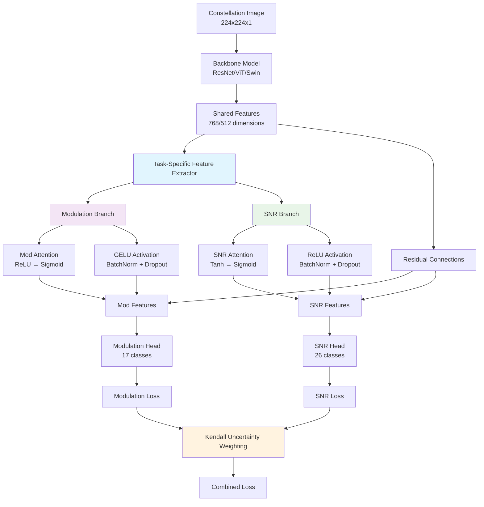

# CLAUDE.md

This file provides guidance to Claude Code (claude.ai/code) when working with code in this repository.

## Project Overview

This is a modulation explainability research project that combines **enhanced multi-task learning** with perturbation-based explainability for Automatic Modulation Classification (AMC). The framework addresses both performance and interpretability challenges by transforming I/Q signal data into constellation diagrams and employing a ResNet-based architecture to simultaneously classify modulation schemes and predict discrete SNR values.

### Research Paper Context
This work was submitted as "Constellation Diagram Augmentation and Perturbation-Based Explainability for Automatic Modulation Classification" and introduces novel perturbation-based explainability techniques using the Perturbation Impact Score (PIS) metric to analyze critical regions in constellation diagrams that drive model decisions.

## Technology Stack

- **Language**: Python 3.11
- **Deep Learning**: PyTorch 2.4.1, TorchVision 0.19.1
- **Data Processing**: NumPy (<2.0), Pandas, H5PY, SciPy
- **Visualization**: Matplotlib, Seaborn
- **Experiment Tracking**: Weights & Biases (wandb)
- **Package Management**: uv (UV package manager)

## Common Development Commands

```bash
# Install dependencies with UV
uv sync

# Train model with default settings (enhanced multi-task learning)
uv run python src/train_constellation.py

# Train with custom parameters and model architecture
uv run python src/train_constellation.py \
    --model_type vit_b_16 \
    --batch_size 32 \
    --snr_list "0,10,20" \
    --mods_to_process "BPSK,QPSK,8PSK" \
    --epochs 100 \
    --base_lr 1e-4 \
    --weight_decay 1e-5 \
    --dropout 0.3 \
    --patience 10

# Train with different architectures
uv run python src/train_constellation.py --model_type resnet18     # Default, fastest
uv run python src/train_constellation.py --model_type resnet34     # Deeper ResNet
uv run python src/train_constellation.py --model_type vit_b_16     # Vision Transformer ViT/16
uv run python src/train_constellation.py --model_type vit_b_32     # Vision Transformer ViT/32 (faster)
uv run python src/train_constellation.py --model_type swin_tiny   # Swin Transformer (fastest, hierarchical)
uv run python src/train_constellation.py --model_type swin_small  # Swin Transformer (balanced)
uv run python src/train_constellation.py --model_type swin_base   # Swin Transformer (largest)

# Resume training from checkpoint (now includes model name)
uv run python src/train_constellation.py --checkpoint checkpoints/best_model_resnet18_epoch_15.pth

# Convert HDF5 data to constellation images
uv run python src/convert_to_constellation.py \
    --h5_dir data/split_hdf5 \
    --snr_list -20,-18,-16,0,10,20,30 \
    --mod_list BPSK,QPSK,8PSK,16PSK

# Test model on perturbed and non-perturbed data
uv run python src/test_constellation.py \
    --model_checkpoint <path_to_checkpoint> \
    --data_dir constellation \
    --perturbation_dir <path_to_perturbation_dir>

# Run hyperparameter sweep with W&B
wandb sweep sweep.yml
wandb agent <sweep_id>

# Generate perturbed constellation data
uv run python src/perturb_constellations.py

# Calculate PID metrics
uv run python src/calculate_pid.py
```

## High-Level Architecture

### Enhanced Multi-Task Learning System
The project implements a **state-of-the-art multi-task learning approach** with:
- **Flexible Backbone Architectures**: ResNet18/34, Vision Transformer (ViT), or Swin Transformer for feature extraction
- **Task-Specific Feature Extraction**: Separate attention and transformation paths prevent task competition
- **Task-Specific Heads**: 
  - Modulation classification (17 digital classes by default)
  - **Discrete SNR prediction** (26 classes: -20 to +30 dB in 2dB intervals)
- **Homoscedastic Uncertainty Weighting**: Well-established Kendall et al. (2018) method that automatically balances task losses using learned uncertainty parameters

### Current Architecture Diagram



### Key Components

1. **Models** (`src/models/`):
   - `ConstellationResNet`: Enhanced ResNet18/34 backbone with **task-specific feature extraction** and dual heads
   - `ConstellationVisionTransformer`: Vision Transformer (ViT-B/16 & ViT-B/32) with **task-specific attention mechanisms**
   - `ConstellationSwinTransformer`: Swin Transformer (Tiny/Small/Base) with hierarchical processing and **task-specific branches**
   - **Task-Specific Feature Extraction**: All models now use separate attention and transformation paths for modulation vs SNR tasks
     - Different activation functions (GELU for mod, ReLU for SNR) create distinct feature distributions
     - Task-specific attention mechanisms prevent feature competition
     - Residual connections with weighted combination (70% task-specific, 30% shared)
   - **Model Selection**: Choose architecture via `--model_type` (resnet18, resnet34, vit_b_16, vit_b_32, swin_tiny, swin_small, swin_base)
   - **Performance Trade-offs**: ResNet fastest (~8-10 it/s), ViT moderate (~2-6 it/s), Swin optimized for sparse data (~5-15 it/s expected)
   - **Default Dataset**: Excludes analog modulations (AM-DSB-SC, AM-DSB-WC, AM-SSB-SC, AM-SSB-WC, FM, GMSK, OOK)

2. **Data Loading** (`src/loaders/`):
   - `ConstellationDataset`: Loads constellation images organized by modulation/SNR
   - `SplitHDF5Dataset`: Direct loader for split HDF5 data format
   - `PerturbationDataset`: Handles perturbed images for robustness testing
   - Images are preprocessed to 224x224 and normalized

3. **Enhanced Loss Functions** (`src/losses/uncertainty_weighted_loss.py`):
   - **`AnalyticalUncertaintyWeightedLoss`**: Homoscedastic uncertainty-based multi-task weighting (Kendall et al. 2018)
     - Well-established method with 1000+ citations and extensive validation
     - Independent task weighting prevents task competition
     - Principled uncertainty modeling with proper regularization
     - Minimum weight constraints (5% per task) for stability
   - **`DistancePenalizedSNRLoss`**: Distance-aware loss for discrete SNR prediction
   - Replaces traditional α/β weighting with learned uncertainty parameters

4. **Data Pipeline**:
   - **Split HDF5**: Pre-organized data by modulation/SNR in `data/split_hdf5/`
   - **Constellation Conversion**: `convert_to_constellation.py` transforms I/Q to images
   - **Training Pipeline**: Direct training from constellation images or HDF5 data
   - **Stratified Splitting**: `utils/data_splits.py` ensures balanced train/val/test distributions

5. **Data Splitting Utilities** (`src/utils/data_splits.py`):
   - **`create_stratified_split()`**: Creates 80/10/10 train/val/test splits with balanced class representation
   - **`verify_stratification()`**: Validates that all (modulation, SNR) combinations are present in each split
   - **Fast Implementation**: Uses cached dataset labels for ~3000x speedup vs individual sample loading
   - **Reproducible**: Fixed random seeds ensure consistent splits across runs

### Data Organization
```
data/
├── RML2016.10a/          # Radio ML datasets
├── RML2018.01A/
└── split_hdf5/           # HDF5 files by modulation type and SNR
constellation/            # Constellation diagram images
perturbed_constellations/ # Perturbed test data
```

### Enhanced Training Strategy
- **Adaptive Multi-Task Learning**: Uncertainty weighting automatically balances modulation and SNR losses
- Adam optimizer with weight decay (1e-5) including uncertainty parameters
- ReduceLROnPlateau scheduler (patience-based)
- **Device-Adaptive Training**: CUDA mixed precision for GPU, optimized MPS/CPU training
- Gradient clipping (max_norm=1.0) for all model and uncertainty parameters
- Early stopping based on validation loss
- **Discrete SNR Training**: 26-class SNR prediction with distance-based penalties
- **Stratified Data Splitting**: 70/15/15 train/val/test split with all classes represented
- **Final Test Evaluation**: Automatic evaluation on held-out test set after training

### Testing and Evaluation
The testing pipeline evaluates models on:
- Original constellation images
- Perturbed images (various blackout percentages)
- Generates confusion matrices and F1 score plots
- Results saved to `confusion_matrices/` and `f1_scores/`
- **Final Test Set Evaluation**: Automatically runs after training completes
- **Stratified Evaluation**: Test set contains balanced representation of all 442 classes

## Research Contributions

### Key Innovations
1. **Multi-Task Learning Framework**: Joint prediction of modulation type (17 digital classes by default) and SNR levels (26 classes), enhancing utility in dynamic wireless environments
2. **Constellation Diagram Augmentation**: Enhanced visual representations using binning, Gaussian smoothing, and normalization techniques
3. **Perturbation-Based Explainability**: Systematic analysis using PIS metric to identify critical constellation regions
4. **Progressive Perturbation Analysis**: Evaluation of classification degradation under varying perturbation levels

### Research Findings
- **High-intensity regions**: Critical for classification (PIS up to 34.8 for 1% brightest pixels)
- **Low-intensity regions**: Minimal impact on performance (PIS as low as 0.95)
- **Multi-task benefits**: Superior SNR prediction and combined accuracy compared to single-task learning
- **Robustness**: Maintains high accuracy across diverse modulation types under challenging noise conditions

## Key Enhancements & Future Work

### ✅ Recent Achievements (2024-2025)
1. **Enhanced Multi-Task Learning**: Kendall et al. (2018) homoscedastic uncertainty weighting with task collapse prevention
2. **Task-Specific Feature Extraction**: Separate attention/transformation paths for modulation vs SNR tasks  
3. **Architecture Expansion**: Support for ResNet18/34, ViT-B/16/32, and Swin Transformer variants
4. **Discrete SNR Prediction**: 26-class classification (-20 to +30 dB) with distance-penalized loss
5. **Stratified Data Pipeline**: 80/10/10 train/val/test splits with balanced class representation

### 🎯 Priority Improvements 
- **High-Order Modulation Performance**: Address 64QAM/256QAM accuracy (current: 66%/79%)
- **Comprehensive Explainability**: Compare perturbation methods with Grad-CAM techniques
- **SOTA Benchmarking**: Add comparisons with MCLDNN, CGDNet, and MoE-AMC baselines

## Important Implementation Notes

### Training System
- **Multi-Task Learning**: Now uses Kendall homoscedastic uncertainty weighting (no manual α/β tuning required)
- **SNR Prediction**: System now operates with discrete 26-class SNR prediction (removed SNR buckets)
- **Device Support**: Optimized for CUDA (with mixed precision), MPS (Apple Silicon), and CPU
- **Package Management**: Uses UV instead of Pipenv for faster dependency management

### Data Pipeline
- **HDF5 Data**: Pre-split by modulation/SNR in `data/split_hdf5/` directory
- **Constellation Images**: Generated from HDF5 using `convert_to_constellation.py`
- **Training Data**: Can train directly from constellation images or HDF5 data
- **Image Format**: 224x224 grayscale constellation diagrams
- **Default Modulations**: Digital only (17 classes) - analog modulations excluded by default

### System Status
✅ **Fully Operational**: Multi-architecture training pipeline with task-specific feature extraction, Kendall uncertainty weighting, and stratified data splitting across CUDA/MPS/CPU devices

## Current Training Configuration

### Updated Default Parameters (Dec 2024)
The training script now uses optimized defaults for full dataset training:
- **Batch Size**: 32 (memory-efficient for large dataset)
- **Learning Rate**: 1e-4 (reasonable for multi-task learning with uncertainty weighting)
- **Epochs**: 100 (sufficient for uncertainty weighting convergence)
- **Patience**: 10 (epochs to wait before reducing LR)
- **Dropout**: 0.3 (regularization to prevent overfitting)
- **Dataset**: 17 digital modulations × 26 SNRs (442 classes total by default)
- **Data Split**: 80% train / 10% validation / 10% test (stratified)
- **Uncertainty Weighting**: Temperature=1.5, min_weight=0.05 (prevents task collapse)
- **LR Scheduler**: ReduceLROnPlateau with factor=0.7 (30% reduction)

### Dataset Statistics
- **Digital Modulation Classes**: 17 (excludes 7 analog modulations by default)
- **Analog Modulations Excluded**: AM-DSB-SC, AM-DSB-WC, AM-SSB-SC, AM-SSB-WC, FM, GMSK, OOK
- **SNR Classes**: 26 (-20 to +30 dB in 2dB intervals)
- **Samples per Mod/SNR**: 4096 (excellent coverage)
- **Total Dataset Size**: ~1.8M samples (digital only)
- **Training Speed**: ~8-10 it/s on Apple M-series (MPS)
- **Estimated Training Time**: ~2 hours per epoch

### Training Performance Expectations
- **Early Learning**: Combined accuracy starts ~15-20% (above 0.23% random baseline)
- **Task Balance**: Kendall method maintains better balance (55%/45%) vs softmax (60%/40%)
- **LR Reduction**: First reduction typically occurs around epochs 10-15
- **Task Specialization**: Gradual weight differentiation emerges without extreme shifts
- **Common Issues**: Overfitting occurs after validation plateau (monitor train/val gap)
- **Realistic Performance** (based on extensive testing):
  - **Validation Combined**: 28-29% plateau (best: 28.33% with Kendall + Swin)
  - **Modulation**: 49-50% validation accuracy
  - **SNR**: 43-44% validation accuracy
  - **Training**: Can reach 40%+ but overfits significantly

### W&B Integration
- **Project**: modulation-explainability
- **Entity**: shamoons
- **MCP Integration**: Installed for advanced monitoring and analysis
- **Install Command**: `claude mcp add wandb -e WANDB_API_KEY=your-key -- uvx --from git+https://github.com/wandb/wandb-mcp-server wandb_mcp_server`

#### 🔄 **IMPORTANT: W&B Description Updates**
**ALWAYS update the W&B description field when making changes to track experiments:**

```python
# In src/training_constellation.py, line 65:
"description": f"Testing [EXPERIMENT_TYPE] with {model_type} - [BRIEF_DESCRIPTION_OF_CHANGES]"
```

**Examples of good descriptions:**
- `"Testing task-specific feature extraction with resnet18 - separate attention/activation for mod vs SNR tasks"`
- `"Testing SNR regression with swin_tiny - continuous SNR prediction instead of 26-class classification"`
- `"Testing temporal constellation sequences with vit_b_16 - multiple frames over time for modulation dynamics"`
- `"Testing binary SNR gating with resnet18 - easy vs hard signal routing for adaptive processing"`

**Update this field for every major change:**
- Architecture modifications (task-specific features, MoE, etc.)
- Loss function changes (regression vs classification, new uncertainty weighting)
- Data pipeline changes (temporal sequences, augmentation)
- Training strategy changes (adaptive learning rates, new regularization)

This ensures proper experiment tracking and comparison in W&B interface.

#### Efficient W&B Run Monitoring Commands
For quick and comprehensive run analysis, use these MCP queries:

```bash
# Get comprehensive run overview (all metrics, system info, config)
mcp__wandb__query_wandb_tool(
    query="""
    query GetRunDetails($entity: String!, $project: String!, $runId: String!) {
        project(name: $project, entityName: $entity) {
            run(name: $runId) {
                id name displayName state
                createdAt updatedAt heartbeatAt
                config summaryMetrics
                historyKeys
                systemMetrics
                tags { name }
            }
        }
    }""",
    variables={"entity": "shamoons", "project": "modulation-explainability", "runId": "eujpigwb"}
)

# Get training history for specific metrics
mcp__wandb__query_wandb_tool(
    query="""
    query GetRunHistory($entity: String!, $project: String!, $runId: String!, $specs: [JSONString!]!) {
        project(name: $project, entityName: $entity) {
            run(name: $runId) {
                id name
                sampledHistory(specs: $specs) {
                    step timestamp item
                }
            }
        }
    }""",
    variables={
        "entity": "shamoons", 
        "project": "modulation-explainability", 
        "runId": "eujpigwb",
        "specs": ["{\"keys\": [\"loss\", \"mod_accuracy\", \"snr_accuracy\", \"learning_rate\"]}"]
    }
)
```

## Quick Troubleshooting
- **Overfitting**: Increase dropout (0.4-0.5), reduce batch size, monitor early stopping
- **Task Collapse**: Fixed with Kendall uncertainty weighting (min_weight=0.05)  
- **Memory Issues**: Reduce batch size, use ResNet18 instead of ViT/Swin
- **Slow Training**: Use ResNet18 (fastest), increase batch size, prefer CUDA over MPS/CPU

### Recent Training Sessions
- **Status**: Multi-task learning with Kendall homoscedastic uncertainty weighting (digital modulations only)
- **Digital Classes**: 17 modulation types (analog excluded by default)
- **Best Achieved Performance**: 28.33% validation combined accuracy (dark-oath-111)
  - Modulation: 49.13% validation accuracy
  - SNR: 43.69% validation accuracy
  - Swin Transformer + Kendall method = optimal combination
- **Key Improvements**: 
  - Kendall method prevents task competition (+2.2% vs softmax method)
  - Task weights more balanced (55.4%/44.6% vs 60.7%/39.3%)
  - Stratified data splitting ensures balanced evaluation
  - Swin Transformer architecture superior to ResNet/ViT for constellation data

## Training Run History & Changelog

### 📊 **W&B Sweep Results Tracking**

**COMPLETED SWEEP - Bayesian Architecture Comparison**: 2025-06-24 (14:33-16:10 UTC)
- **Sweep ID**: 38l3qtga ✅ **COMPLETED**
- **Duration**: ~1.5 hours with 7 parallel agents
- **Key Findings**: ResNet18 dominated (25.11% best), Swin struggled with small batches
- **Best Result**: **dandy-sweep-2** - 25.11% combined (45.59% mod, 42.02% SNR)

---

**NEW SWEEP - Large Batch High-Speed Training**: Created 2025-06-24
- **Sweep ID**: 6wtilhal  
- **Sweep Config**: `sweep_architecture_comparison.yml` (Large batch Bayesian optimization)
- **Architectures**: ResNet18/34, ViT-B/16/32, Swin-Tiny  
- **Parameters**: **Large batch sizes (256-1024)**, dropout (0.1-0.5), learning rate (1e-5 to 1e-3), weight decay (1e-6 to 1e-3)
- **Strategy**: Fewer agents (2-3) with large batches for **4-8x faster epoch completion**
- **Expected Benefits**: Reach epochs 5-10+ vs previous epochs 1-2, better convergence insights
- **Early Stopping**: Hyperband (min 3 epochs) + performance threshold (15% accuracy)
- **Status**: **READY TO START** 
- **Sweep URL**: https://wandb.ai/shamoons/modulation-explainability/sweeps/6wtilhal

#### Expected Memory Usage:
- **ResNet18 + batch=1024**: ~8-10GB per agent
- **ResNet34 + batch=1024**: ~10-12GB per agent  
- **Swin/ViT + batch=512**: ~8-12GB per agent
- **Total agents**: 2-3 concurrent (vs previous 7)

#### Previous Sweep Results Summary:
- **🏆 Best Performance**: **dandy-sweep-2** (ResNet18) - **25.11% combined**
- **Architecture Ranking**: ResNet18 > ResNet34 > Swin-Tiny (by speed and early performance)
- **Key Insight**: Mid-range SNRs (-2 to 12 dB) consistently strongest
- **Speed Advantage**: ResNet 3-4x faster than Swin for epoch completion

---

### 📚 **Historical Training Results Archive**

Previous individual training runs for reference (retained for comparison):

**Best Historical Result**: 28.33% validation combined accuracy
- **Run**: dark-oath-111 (Swin-Tiny + Kendall uncertainty + task-specific features)
- **Architecture**: Swin Transformer with task-specific feature extraction
- **Key Success Factors**: Kendall uncertainty weighting, balanced task weights (55.4%/44.6%)

**Architecture Performance Summary**:
- **Swin Transformer**: 28.33% (best overall, good speed/accuracy balance)
- **Vision Transformer**: 20-25% range (moderate performance, slower training)
- **ResNet18/34**: 20-27% range (fastest training, competitive accuracy)

**Critical Insights Learned**:
- **Task-Specific Features**: Prevent competition between modulation/SNR tasks
- **Kendall Uncertainty**: Superior to softmax weighting (+2.2% improvement)
- **Early Stopping**: Essential to prevent overfitting (typically occurs epochs 12-18)
- **Batch Size**: Memory-constrained optimal range 32-256 for parallel training